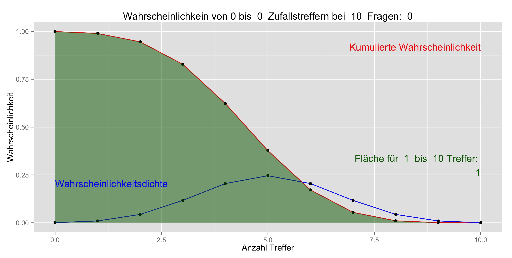

---
# Change the title etc. to your needs:
title: "Vignette for package yart"
subtitle: "At least it pretends to"
author: "Sebastian Sauer"
course: 'Seminar: Solutions to All and Nothing'
address: My Road 1, 12345 Somesmalltown
field: Sophism
logo: examples/logo.png
referee: 'Referee: Prof. Dr. I. Weiss-Ois'
ID: 'My Immatriculation ID: 12345679'


abstract: |
  Yart provides an RMarkdown template for rendering TeX based PDFs. It provides a format suitable for academic settings. The typical RMarkdown variables may be used. In additiion, some variabels useful for academic reports have been added such as name of referee, due date, course title, field of study, addres of author, and logo, and a few more maybe. Adjust those variables to your need. Note that citations, figure/ table referencing is possible due to the underlying pandoc magic.
  

# Change name of bibliogrphic files:
bibliography: examples/bib.bib
csl: examples/apa6.csl  # citation style file


# Change only if you know what you are doing:
date: '`r format(Sys.Date(), "%d\\. %m\\. %Y")`'  # today
fontfamily: lmodern
fontsize: 11pt
graphics: null
lang: de-De
lof: yes
lot: yes
toc: yes
numbersections: yes
UP_title: yes
UP_subtitle: yes
shaded_quote: no
output: 
  yart::yart

vignette: |
  %\VignetteIndexEntry{Vignette for package yart}         %\VignetteKeywords{yart, vignette}           
  %\VignettePackage{yart} 
  %\VignetteEngine{knitr::rmarkdown} 
  %\VignetteEncoding{UTF-8}
  \usepackage[utf8]{inputenc}
---


# Section Header 1


Please see the documentation of [RMarkdown](http://rmarkdown.rstudio.com/) for more details on how to write RMarkdown documents.


## Section Header 2


Lorem ipsum dolor sit amet, consectetur adipiscing elit. Proin mollis
dolor vitae tristique eleifend. Quisque non ipsum sit amet velit
malesuada consectetur. Praesent vel facilisis leo. Sed facilisis
varius orci, ut aliquam lorem malesuada in. Morbi nec purus at nisi
fringilla varius non ut dui. Pellentesque bibendum sapien velit. Nulla
purus justo, congue eget enim a, elementum sollicitudin eros. Cras
porta augue ligula, vel adipiscing odio ullamcorper eu. In tincidunt
nisi sit amet tincidunt tincidunt. Maecenas elementum neque eget dolor
[egestas fringilla](http://example.com):


> Nullam eget dapibus quam, sit amet sagittis magna. Nam tincidunt,
> orci ac imperdiet ultricies, neque metus ultrices quam, id gravida
> augue lacus ac leo.

Vestibulum id sodales lectus, sed scelerisque quam. Nullam auctor mi
et feugiat commodo. Duis interdum imperdiet nulla, vitae bibendum eros
placerat non. Cras ornare, risus in faucibus malesuada, libero sem
fringilla quam, ut luctus enim sapien eget dolor.


- bullet lists are possible

- \LaTeX is being supported. \LaTeX code can be intermingled.

- Math can be included: $e^{ln(e)}=e$ (is that correct???).

- See [here](http://pandoc.org/README.html#pandocs-markdown) for an overivew on the pandoc's markdwon syntax.

- Ein paar Gimmicks: H~2~O, This ~~is deleted text.~~, feas*ible*, not feas*able*, lang---ganz lang.

- Use `\ts` as a shorthand for `\thinspace` to get "z.\ts B." instead of  "z. B." (thin space between the two letters)

- Footnotes are supported[^1].

- Zitationen sind möglich, im beliebigen Format, z.B. APA6. Das Format wird über die Variable `cls` definiert (im Kopfteil oben). Die entsprechende Datei muss im gleichen Ordner liegen wie diese Rmd-Datei. Die Datei mit den bibliographischen Informationen wird über die Variable `bibliography` angegeben. Auch diese Datei muss sich im gleichen Ordner befinden wie diese Rmd-Datei. 

- Besonders schön ist es, dass man [R](https://cran.r-project.org) direkt einbinden kann über [knitr](http://yihui.name/knitr/). [Hier](http://galahad.well.ox.ac.uk/repro/) findet sich eine gute Anleitung.


[^1]: Fußnoten sind bei Pandoc eine Art von Links. 


We report how we determined our sample size, all data exclusions (if any), all manipulations, and all measures in the study. <!-- 21-word solution (Simmons, Nelson & Simonsohn, 2012; retrieved from http://ssrn.com/abstract=2160588) -->


# R-Code

Add R code to your document:

```{r}
x <- c(1,2,3)
mean(x)
```


# Tables
Lorem ipsum dolor sit amet, consectetuer adipiscing elit. Aenean commodo ligula eget dolor. Aenean massa. Cum sociis natoque penatibus et magnis dis parturient montes, nascetur ridiculus mus. Donec quam felis, ultricies nec, pellentesque eu, pretium quis, sem. Nulla consequat massa quis enim. Donec pede justo, fringilla vel, aliquet nec, vulputate eget, arcu. In enim justo, rhoncus ut, imperdiet a, venenatis vitae, justo. Nullam dictum felis eu pede mollis pretium. Integer tincidunt. Cras dapibus. Vivamus elementum semper nisi. Aenean vulputate eleifend tellus. Aenean leo ligula, porttitor eu, consequat vitae, eleifend ac, enim. Aliquam lorem ante, dapibus in, viverra quis, feugiat a, tellus. Phasellus viverra nulla ut metus varius laoreet. 

So erstellt man "von Hand" eine Tabelle in Markdown

  Right    Left     Center     Default
-------    ------ ----------   -------
     12     12        12            12
    123     123       123          123
      1     1          1             1
      
Table: Table caption


There are comfortable and powerful R packages available for rendering markdown tables such as Huxtable, or xtable, and other.


Table with R package `xtable`; note that this package needs to be installed to run this example.

```{r xtable-example, eval = FALSE}
data(mtcars)

library(xtable)
print.xtable(
  xtable(head(daten), 
         label="tab:daten", 
         caption="Datenstruktur für eine within-Analyse"), 
  comment=FALSE)
```


# Citation

Put the file with the references in the same folder as the rmd-file. Uncomment/insert a line in the yaml header such as `bibliography: bib.bib`, where `bib.bib` is the name of your bib-file. Similarly, if you want to format the citation in a certain style, put the respective csl-file in the same folder as this document and uncomment/insert this line in the yaml header: `csl: apa6.csl`, where `apa6.csl` is the style file.

Let's cite something [@Roberts2007].

Use this format for citation: "[\@bibtexkey]".


# Figures

Use knit to insert images. Figures can be referenced, cf. Figure \ref{fig:fig1}. Alternatively, use R code to plot figures.


```{r fig1, echo = TRUE, fig.cap = "Example of a figure", out.width = "50%"}
#
plot(mtcars$hp)
```


\pagebreak


#Literatur

(If some literature is cited, it appears here)

\setlength{\parindent}{-0.5in}
\setlength{\leftskip}{0.5in}
